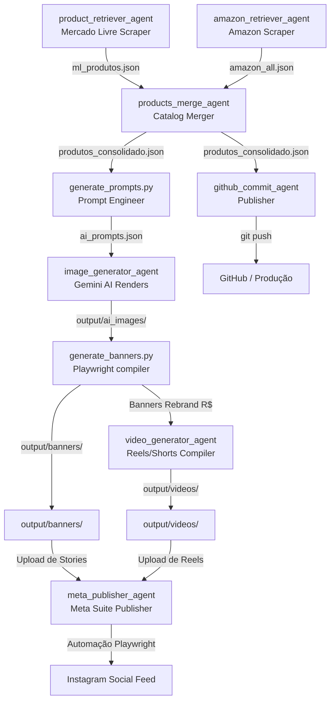

# 🤖 Especificações de Agentes de IA (Agentes de IA)

Este documento especifica a arquitetura dos **7 agentes especializados** configurados neste projeto. Ele serve como documentação de portabilidade para que **qualquer outro assistente de IA** (como Gemini, Claude, GPT, etc.) consiga assumir o controle do pipeline, compreender suas responsabilidades e executar os comandos corretos de forma autônoma.

---

## 📂 Visão Geral da Arquitetura

O pipeline é composto por 7 agentes que atuam em cadeia para realizar a extração, consolidação, geração de imagens por IA, renderização de banners visuais, compilação de vídeos sociais, sincronização git e publicação das mídias:



---

## 1. 🔷 `product_retriever_agent` (Executor Mercado Livre)
* **Objetivo:** Raspar ofertas relâmpago do Mercado Livre de forma assíncrona.
* **Comando de Execução:**
  ```powershell
  venv\Scripts\python main.py --source mercadolivre
  ```
  *(Parâmetros adicionais opcionais: `--pages 5`, `--delay 1.5`, `--reset`)*
* **Entradas:** Ambiente virtual ativo, pacotes do `requirements.txt` instalados.
* **Saídas:** Arquivo [output/ml_produtos.json](file:///C:/Users/ferna/development/amazon-products/output/ml_produtos.json).

---

## 2. 🔷 `amazon_retriever_agent` (Executor Amazon Brasil)
* **Objetivo:** Raspar os mais vendidos da Amazon Brasil em alta resolução, gerando links curtos de afiliado via SiteStripe usando Playwright de forma automatizada.
* **Comando de Execução:**
  ```powershell
  venv\Scripts\python main.py --source amazon
  ```
  *(Parâmetros adicionais opcionais: `--top-n 40`)*
* **Entradas:** Sessão persistente [amazon_cookies.json](file:///C:/Users/ferna/development/amazon-products/amazon_cookies.json), navegador Chromium instalado via Playwright.
* **Saídas:** Arquivo consolidado estável [output/amazon_all.json](file:///C:/Users/ferna/development/amazon-products/output/amazon_all.json).

---

## 3. 🔷 `products_merge_agent` (Consolidador de Catálogos)
* **Objetivo:** Unificar as saídas consolidadas de ambas as fontes e atualizar o arquivo Javascript de exibição web.
* **Comando de Execução:**
  ```powershell
  venv\Scripts\python merge.py
  ```
* **Entradas:** Arquivos [output/amazon_all.json](file:///C:/Users/ferna/development/amazon-products/output/amazon_all.json) e [output/ml_produtos.json](file:///C:/Users/ferna/development/amazon-products/output/ml_produtos.json).
* **Saídas:**
  - Base de dados unificada: [output/produtos_consolidado.json](file:///C:/Users/ferna/development/amazon-products/output/produtos_consolidado.json)
  - Módulo da Web: [output/produtos.js](file:///C:/Users/ferna/development/amazon-products/output/produtos.js)

---

## 4. 🔷 `image_generator_agent` (Designer Gráfico & IA Generativa)
* **Objetivo:** Gerar banners verticais de alta resolução (1080x1920px) baseados no template oficial da página. O agente implementa uma **camada de IA generativa híbrida** que substitui fundos de e-commerce genéricos por backdrops publicitários 3D sob medida.
* **Pipeline de IA Generativa**:
  1. **Engenharia de Prompts (`generate_prompts.py`)**: Analisa o produto e sua categoria (Tecnologia, Games, Beleza, Lar) e cria dinamicamente prompts fotográficos avançados em inglês, salvando-os em [output/ai_prompts.json](file:///C:/Users/ferna/development/amazon-products/output/ai_prompts.json).
  2. **Geração Física (Google Gemini Model)**: Executa a geração nativa via modelo de imagem gerando cenas de estúdio premium e salvando os assets em [output/ai_images/achadinho_{slug}.png](file:///C:/Users/ferna/development/amazon-products/output/ai_images/).
  3. **Composição do Banner (`generate_banners.py`)**: O renderizador Playwright busca localmente se existe uma imagem em `ai_images/` para o slug correspondente. Se existir, carrega-a prioritariamente usando a URL de arquivo seguro `file:///`, sobrepondo os preços e a logomarca da página.
* **Rebranding Oficial ("Achadinhos por Aí")**:
  - Cabeçalho e rodapé atualizados para exibir o nome completo da marca: **`ACHADINHOS POR AÍ`**.
  - Tipografia de CSS redimensionada de `72px` para `44px` com sombras reflexivas ajustadas para se adequar perfeitamente a uma linha vertical premium.
* **Comando de Execução:**
  ```powershell
  # 1. Gerar prompts
  venv\Scripts\python generate_prompts.py
  # 2. Renderizar banners (com cache inteligente ou forçado)
  venv\Scripts\python generate_banners.py --limit 12 --force
  ```
  *(Parâmetros adicionais opcionais: `--limit <n>` (limitar quantidade), `--all` (gerar para todos os produtos), ou `--force` (ignorar cache e forçar regeração))*
* **Entradas:** Catálogo consolidado, Playwright Chromium, assets locais gerados por IA em `output/ai_images/`.
* **Saídas:** Banners promocionais salvos na pasta [output/banners/](file:///C:/Users/ferna/development/amazon-products/output/banners/).

---

## 5. 🔷 `video_generator_agent` (Editor de Vídeo - Reels/Shorts)
* **Objetivo:** Compilar vídeos promocionais verticais (1080x1920px H.264 MP4) prontos para publicação no Instagram, TikTok e Shorts, a partir dos banners de alta fidelidade atualizados pela IA e pelo rebranding. Suporta o agrupamento e geração em lote para todo o catálogo.
* **Comando de Execução (Gerar lote de 15 imagens para todo o catálogo usando transição lateral):**
  ```powershell
  venv\Scripts\python generate_video.py --limit 15 --transition slideleft --all
  ```
  * **Modo Lote (`--all` ou `-a`)**: Processa todos os banners na pasta `output/banners/` e os divide em múltiplos vídeos sequenciais de 15 imagens cada. Se restarem banners que não preencham o lote completo de 15, o script reaproveita de forma inteligente banners para garantir que o vídeo final possua no mínimo 2 banners e execute transições perfeitamente.
  * **Outros Parâmetros Úteis:**
    * `--limit <n>`: Quantidade de banners por vídeo/lote (padrão: 15).
    * `--duration <segundos>`: Tempo de exibição de cada slide (padrão: 3.0s).
    * `--trans-duration <segundos>`: Duração da transição xfade (padrão: 0.5s).
    * `--transition <estilo>`: Estilo da transição. Excelente suporte para `slideleft` (transição lateral), `fade` (fusão suave), `slideup`, `wipeleft`, etc.
    * `--random`: Embaralha a ordem de todos os banners antes do lote.
    * `--category <categoria>` ou `-c <categoria>`: Filtra e gera vídeos apenas para uma categoria específica (ex: `--category tech` ou `--category pets`).
    * `--all-categories`: Agrupa e compila dinamicamente vídeos separados para todas as categorias disponíveis que possuem no mínimo 2 banners.
* **Entradas:** Arquivos de banners promocionais rebrandados em [output/banners/](file:///C:/Users/ferna/development/amazon-products/output/banners/), catálogo [output/produtos_consolidado.json](file:///C:/Users/ferna/development/amazon-products/output/produtos_consolidado.json), FFmpeg instalado no sistema.
* **Saídas:** Um ou múltiplos vídeos verticais salvos na pasta [output/videos/](file:///C:/Users/ferna/development/amazon-products/output/videos/) com nomes sistemáticos `reels_<categoria>_<transição>_part<n>_<timestamp>.mp4` (ou `reels_<transição>_part<n>_<timestamp>.mp4` no modo global).

---

## 6. 🔷 `github_commit_agent` (Publicador de Produção)
* **Objetivo:** Sincronizar os dados consolidados gerados pelo bot com o repositório GitHub de exibição em produção do bot.
* **Comando de Execução:**
  ```powershell
  venv\Scripts\python commit.py
  ```
* **Entradas:**
  - Origem: [output/produtos_consolidado.json](file:///C:/Users/ferna/development/amazon-products/output/produtos_consolidado.json)
  - Repositório Git Destino: `C:\Users\ferna\development\achadinhos-bot\achadinhosporai-v2-data`
* **Saídas:** Git commit e push bem-sucedido na branch `main` no repositório de dados final.

---

## 7. 🔷 `meta_publisher_agent` (Publicador de Redes Sociais)
* **Objetivo:** Publicar em lote de forma 100% automatizada e headless os vídeos como Reels e banners em destaque como Stories (com links de afiliados) diretamente no Instagram através do painel do Meta Business Suite.
* **Comando de Execução:**
  ```powershell
  # 1. Autenticação manual de segurança inicial (cria output/meta_session.json)
  venv\Scripts\python meta_session_helper.py
  # 2. Auto-publicação de Reels
  venv\Scripts\python meta_publisher.py --type reels --limit 5
  # 3. Auto-publicação de Stories com links de afiliados
  venv\Scripts\python meta_publisher.py --type stories --limit 15
  ```
* **Entradas:**
  - Cookies de sessão: `output/meta_session.json`
  - Banners e links de afiliados: `output/banners/` e `output/produtos_consolidado.json`
  - Vídeos verticais de Reels: `output/videos/`
* **Saídas:** Publicações de mídia social ativas no feed do Instagram.

---

## 📅 Agendamento Recorrente Geral (Cron)

Para manter todo o ecossistema de achadinhos dinâmico, o pipeline em cadeia dos agentes roda automaticamente a **cada 3 horas**:
1. Rodar `product_retriever_agent` (Extração ML)
2. Rodar `amazon_retriever_agent` (Extração Amazon)
3. Rodar `products_merge_agent` (Merge e consolidação)
4. Rodar `generate_prompts.py` (Atualização de prompts)
5. Executar geração de imagens por IA para os novos destaques do dia.
6. Rodar `image_generator_agent` (Geração física dos banners de alta fidelidade)
7. Rodar `video_generator_agent` (Compilação dos Reels atualizados para mídias sociais)
8. Rodar `github_commit_agent` (Publicação automática no repositório web)
9. Rodar `meta_publisher_agent` (Publicação automática das mídias no Instagram)

*Expressão Cron de agendamento em background:* `0 */3 * * *`
